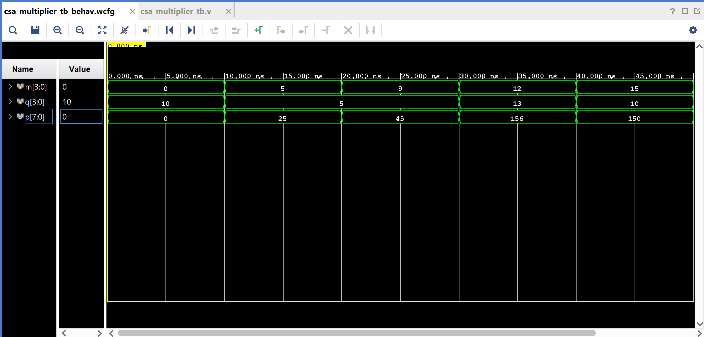
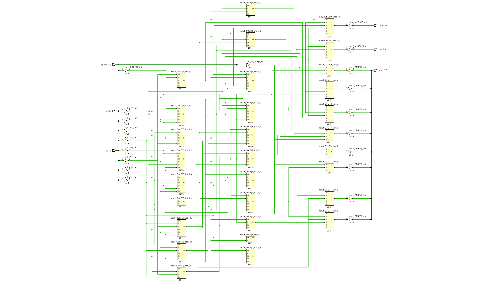
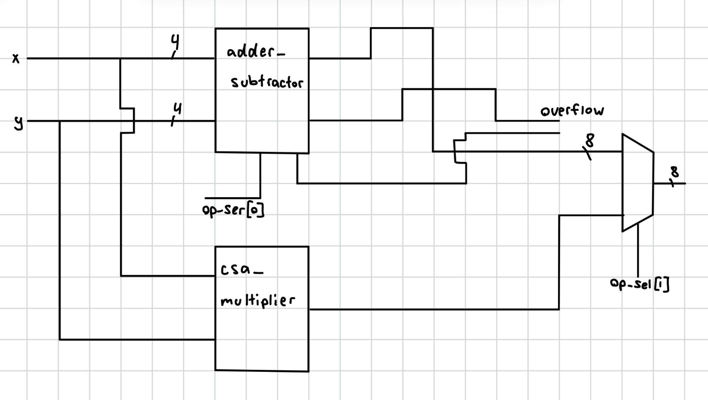

# ece3300L-lab1 : Multiplier and Simple Calculator

## Files
- `verilog/mq_4bit.v` – partial product AND-row generator
- `verilog/csa_multiplier.v` – 4x4 carry-save array multiplier
- `verilog/csa_multiplier_tb.v` – testbench for the multiplier
- `verilog/mux_2x1_8bit.v` – 8-bit 2x1 mux used in the calculator
- `verilog/simple_calc.v` – top-level calculator module
- `verilog/simple_calc.xdc` – board constraints for the Nexys A7-100T

## Part 1: Simulation
Waveform showing all 5 required test vectors (m, q, p in unsigned decimal):

## Schematic

## Part 2: Block Diagram

## Demo Video
[Calculator demo video](video/IMG_4955.mp4)
